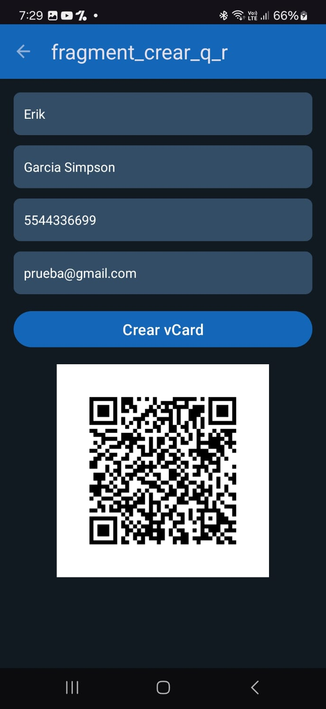

# Lector y generador de códigos QR.

This is a simple Kotlin app developed in **Android Studio**, provides functionalities for reading and generating QR codes.

## Description

The app offers two main features:

1. **QR Code Reader**
   - Scans QR codes with the following types of information:
     - URLs (open in the browser).
     - Electronic business cards (vCard) for adding contacts.
   - Displays error messages if the QR code is invalid or unsupported.

2. **QR Code Generator**
   - Generates QR codes in vCard format using user-input data through a form with validations:
     - **Name** (required).
     - **Phone** (10 digits, required).
     - **Email** (optional).

### Example of a vCard
```plaintext
BEGIN:VCARD
VERSION:3.0
FN:Erik Garcia Simpson
TEL:5544336699
EMAIL:persona@comunidad.unam.mx
END:VCARD
```

## Preview 

| Main Screen                                         | Create vCard                                            | Create QR                                                  |
| --------------------------------------------------- | ------------------------------------------------------- | ---------------------------------------------------------- |
|                 |                     |                        |

| Permissions                                         | Scan QR                                                 | Saves the contact                                          |
| --------------------------------------------------- | ------------------------------------------------------- | ---------------------------------------------------------- |
|                 |                     |                        |

## How to Use
1. **Main Screen**:
   - Button to scan QR codes.
   - Button to access the QR code generator with input form.
2. **Scanning**: Automatically detects the type of information and performs the corresponding action.
3. **Generating**: Enter data in the form and generate a QR code in vCard format.

## Technologies Used
- Language: **Kotlin**
- IDE: **Android Studio**
- Libraries: **ZXing** (for QR code scanning and generation).

## Installation
1. Clone this repository:
   ```bash
   https://github.com/ErikGarciaLopez/CodigosQR.git
   ```
2. Open it in Android Studio.
3. Compile and run it on a device with API >= 24.
